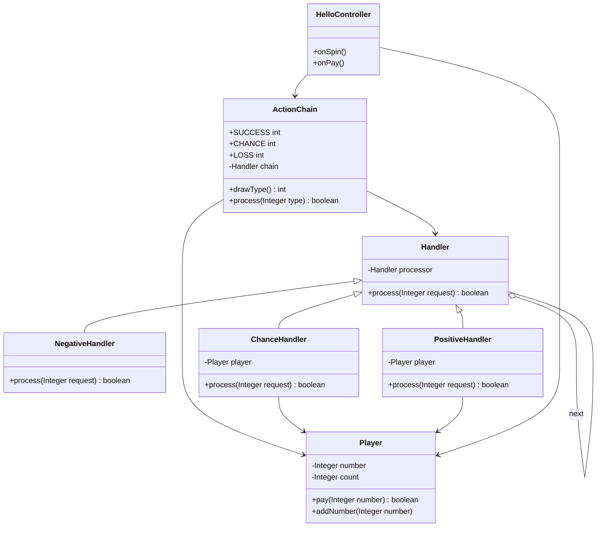
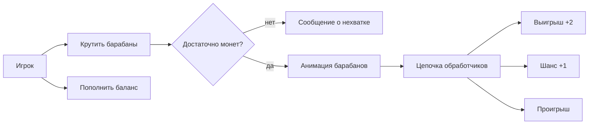
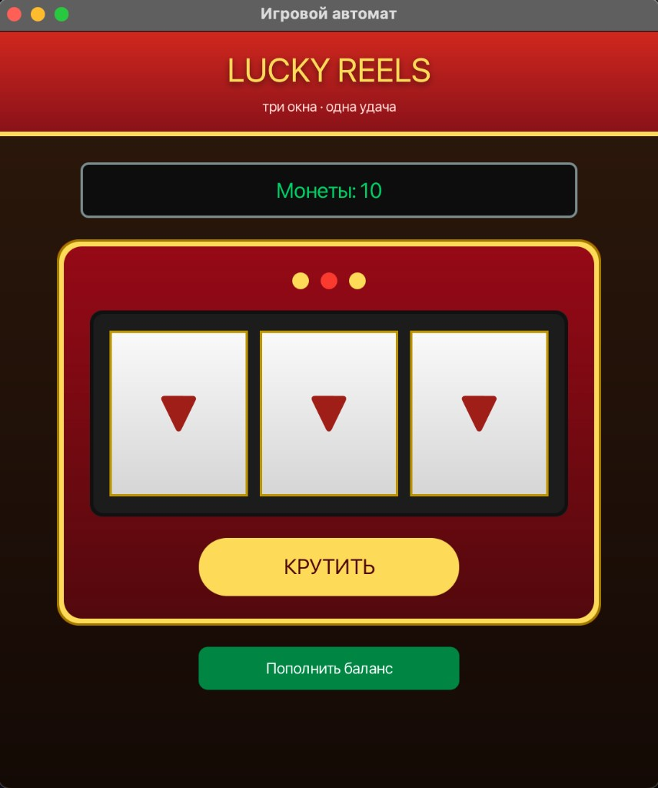
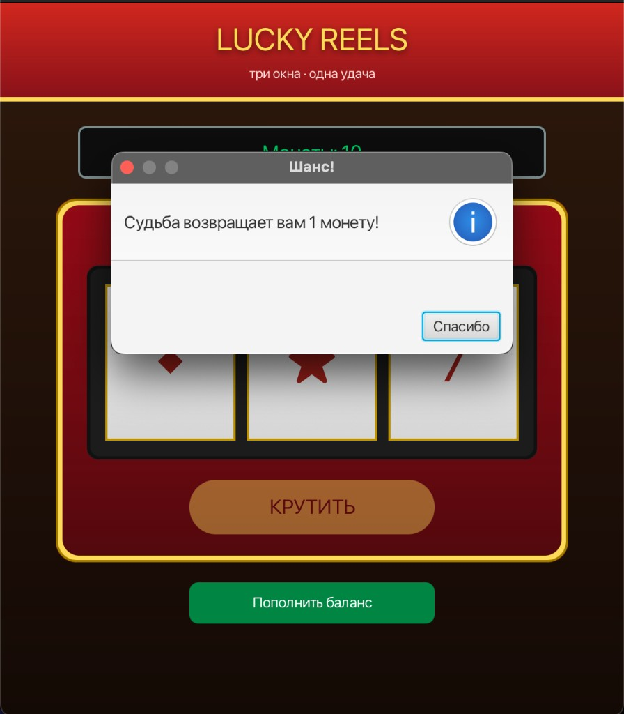

# Lucky Reels

Лабораторная работа — паттерн Цепочка обязанностей (Chain of Responsibility).

Десктопное JavaFX-приложение — игровой автомат «Lucky Reels».

---


# Описание

Приложение реализует простой игровой автомат с тремя барабанами.

Игрок начинает с фиксированного количества монет и может крутить барабаны, оплачивая каждое вращение одной монетой.

После вращения случайным образом определяется один из возможных исходов:

* Выигрыш
* Шанс
* Проигрыш

Для обработки результата вращения используется паттерн **Chain of Responsibility**, который позволяет передавать исход по цепочке обработчиков до тех пор, пока не будет найден подходящий обработчик.

Вероятности зависят от числа уже сделанных ставок: чем больше игрок крутит, тем реже выпадают выигрыш и шанс.

---
# Диаграммы

## Диаграмма классов (Chain of Responsibility)



## Use Case



## Вид приложения




# Функционал

| Действие            | Описание                                              |
| ------------------- | ----------------------------------------------------- |
| Вращение барабанов  | Стоимость одного вращения — 1 монета                  |
| Анимация            | Смена символов на трёх барабанах через Timeline       |
| Выигрыш             | Три одинаковых символа, игрок получает +2 монеты      |
| Шанс                | Игроку возвращается 1 монета                          |
| Проигрыш            | Разные символы, игрок ничего не получает              |
| Пополнение          | Добавляет 1 монету                                    |
| Отображение баланса | Текущее количество монет игрока                       |

---

# Архитектура

```text
src/main/java/com/example/composite/
├── Launcher.java
├── HelloApplication.java
├── HelloController.java
├── Player.java
├── Handler.java
├── ActionChain.java
├── NegativeHandler.java
├── ChanceHandler.java
└── PositiveHandler.java

src/main/resources/com/example/composite/
└── hello-view.fxml
```

## Основные классы

| Класс            | Назначение                           |
| ---------------- | ------------------------------------ |
| Launcher         | Точка входа `main`                   |
| HelloApplication | Точка входа JavaFX                   |
| HelloController  | Логика интерфейса и анимация         |
| Player           | Баланс и счётчик ставок              |
| Handler          | Базовый обработчик цепочки           |
| ActionChain      | Сборка цепочки и выбор типа исхода   |
| NegativeHandler  | Обработка проигрыша                  |
| ChanceHandler    | Обработка шанса                      |
| PositiveHandler  | Обработка выигрыша                   |

Цепочка собирается так:

```text
NegativeHandler → ChanceHandler → PositiveHandler
```

# Правила игры

Начальный баланс:

```text
10 монет
```

Стоимость вращения:

```text
1 монета
```

Пополнение:

```text
+1 монета
```

Вероятности зависят от числа ставок (`Player.count`):

| Ставок | Шанс (+1) | Выигрыш (+2) | Проигрыш |
| ------ | --------- | ------------ | -------- |
| 1–3    | 40%       | 30%          | 30%      |
| 4–8    | 20%       | 35%          | 45%      |
| 9+     | 10%       | 25%          | 65%      |

Если баланс становится равным нулю, игрок может:

* Пополнить баланс

---

* JavaFX 17
* Maven
* FXML
* MVC
* Chain of Responsibility (GoF)
